# User's Manual
##### For v1.0.24 SW

## Table of contents
- [Getting started](#getting-started)
- [How to use](#how-to-use)
- [Settings menu](#settings-menu)
- [Troubleshooting](#troubleshooting)
- [Calibration](#calibration)

---

## Getting started
This document assumes that you have:
- An assembled Controller from us OR made your DIY version and fully tested beforehand,
- Followed the [hot air gun guide](hotairgun_guide.md) and have a suitable hot air gun and a stand at hand,
- Installed the correct fuse for your country (220V: 4A, 110V: 8A) to the Controller,
- Connected the Controller to a GFCI protected outlet.

The Controller itself can work with 100-250V AC, 30-80Hz and requires a clean AC line, like all TRIAC based devices. **Using it with generators or especially modified sine / square wave / line-interactive / cheap UPSes is not recommended.** True sine wave / online UPSes over 1KVa should work fine. In fact, the Controller designed to tolerate dirty networks and more forgiving than most appliances but reliable operation is not guaranteed if anything other than your standard AC line is being used.

---

## How to use
You control everything with the knob. Rotating right (clockwise) means increase; rotating left (counterclockwise) is decrease. Short press (click) will change between temperature and air in the main screen, it means select/OK on settings. A long press will take you to the settings, or takes you back to the main screen if you're already in a menu.

This is the main screen.

You can choose to adjust temperature and air. Currently temperature is selected, so if you rotate the knob the set (target) temperature will change. 

While you're changing the temperature, the set value moves to the top for a short period so you can see and adjust it easier. In that short period, the current temperature can be seen at bottom.

For changing the selection, "click" (shortly press) the knob.

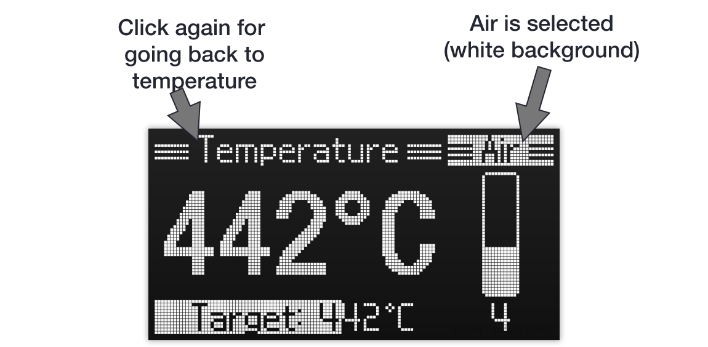

Now the air is selected. You can change the air setting by rotating the knob.

If you put the tool on stand, Controller switches to Standby mode. It'll start to cool the nozzle using with maximum air speed. Fan will stop when it is cooled down. When you pick it from the stand, it immediately starts heating using the last temperature and air values.

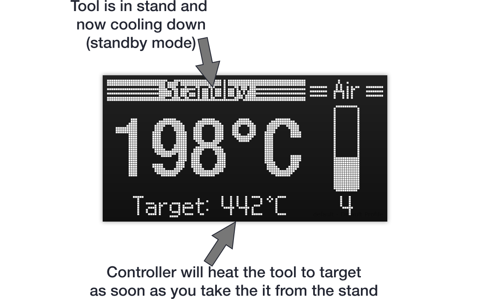

That's it. Happy reworking!

---

## Settings menu

A long press to the knob will take you to the settings. It takes you back to the main screen if you're already in a menu. Use the long press for exit without saving. Click (short press) for choosing the selected option.

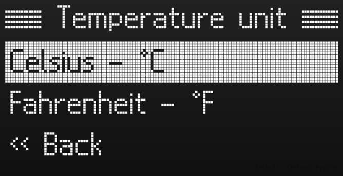

**Temperature unit** 

You can select your temperature unit of your choice between Celsius or Fahrenheit.
 

------

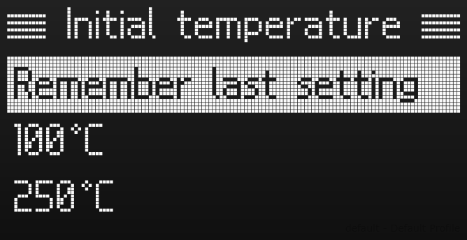

**Initial temperature** 

You can select the temperature when the Controller boots up. It'll remember the last setting by default.
 

------

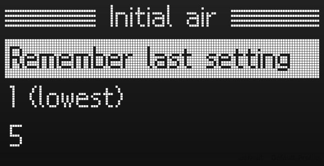

**Initial air**

You can select the air when the Controller boots up. It'll remember the last setting by default.
 

------

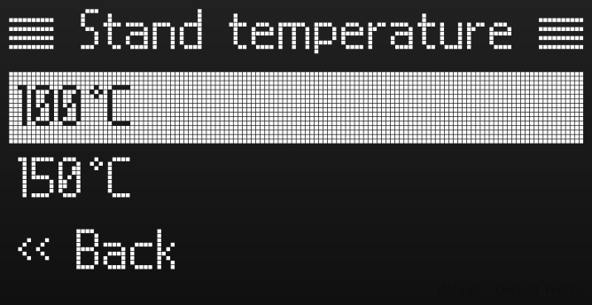

**Stand temperature** 

Controller will cool the tool when it is in the stand for safety purposes. You can set that cooldown threshold here.
 

------

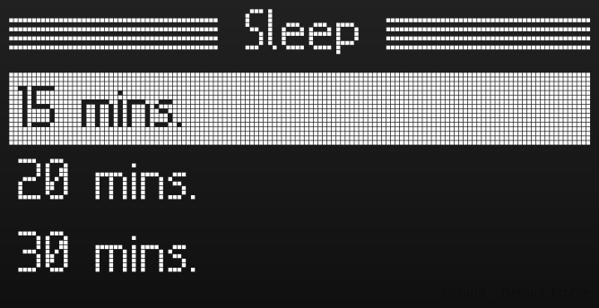

**Sleep** 

Controller will enter to sleep mode if the tool stays in the stand for a while. You can select that timeout here. It will wake up when you take the tool from the stand, remove the tool or touch the encoder. 
 

------

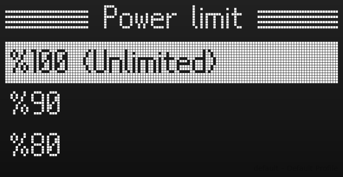

**Power limit** 

Controller can limit the power that it'll deliver to the tool. This will reduce the heating performance so it is recommended to keep it at full power for daily usage. If you have to use your Controller with an underpowered generator or UPS, this will help you.
 

------

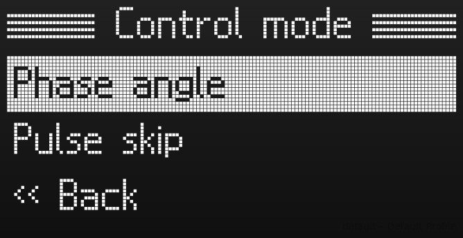

**Control mode** 

This is an advanced setting for choosing how the power is delivered to the heater. In contrast of phase angle control, the pulse skip mode will deliver full half waves to the heater without chopping, thus minimizing the noise. Do not use pulse skip on small UPSes or generators, this setting makes them unhappy. Phase angle is the default setting.
 

------

**About** 

Gives the firmware version, language and operation time. Long press to exit.

------

**Exit** 

Returns you to the main screen.

---

## Troubleshooting

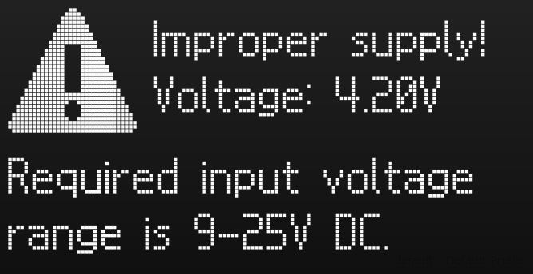

**Improper supply error** 

This is related to internal SMPS that powers the Controller and the tool fan. Controller will refuse to work when its supply is out of the range. Power cycle the unit, if the error clears itself you'll most likely encountered a power glitch comes from your national grid. 

If the error keeps reappearing, you should measure the output voltage from the internal SMPS. If the readings are also out of the range, change the SMPS. If the readings are OK, check the voltage divider resistors on Controller PCB.
 

------

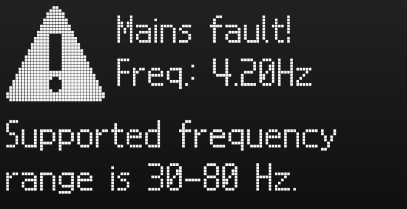

**Mains fault** 

Controller needs to precisely follow the mains frequency for controlling the heater. If the mains frequency out of limits for a while, it'll shut off and gives this error. Since the Controller is extremely flexible about the frequency, this error is fairly rare and generally related with a power outage. If your AC power blips you may get this error. Power cycle the unit and it'll clear out. 

If you're trying to use the Controller with a "synthetic" supply (a generator or UPS) and you keep getting this error, it generally means your supply generating extreme amount of noise or instead producing a sinewave it outputs ＶＡＰＯＲＷＡＶＥ or something. Jokes aside, it means the Controller cannot work with this supply. Please use a normal AC outlet.
 

---

## Calibration

**Note:** If you have got an assembled Controller from us, it is already calibrated. **Calibration menu do not have the usual safeguards and it won't prevent you messing something up. Proceed with caution.** It is suggested to take a note of current settings before changing anything.

If you DIY your controller, the calibration menu will automatically pop up on the first power on. You can skip the this by long pressing, but it'll keep asking until you do (and tell the controller as such).

For entering the calibration menu, go to Settings > About and click the knob 10 times. Here is what you get:

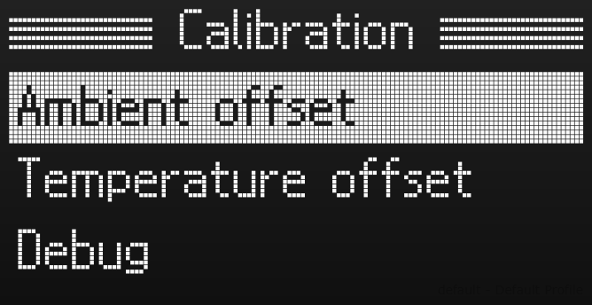

There is two different offsets available for calibration: ambient and temperature. Ambient will trim the internal NTC, temperature is for the thermocouple in the tool. **Both settings will have an effect on the final temperature reading.**

**Start the calibration with a cold (room temp.) controller for the best accuracy. Set air to the max. Switch controller to Celsius. Use the phase angle control mode.** You'll need a external temperature measurement device to calibrate against, so by definition it should be good enough. Your calibration device of choice should measure 300°C.

Calibration screens are pretty self-explanatory. Start with the ambient offset. Adjust it so the *Val* represents the actual ambient temperature. Click for save the offset. 

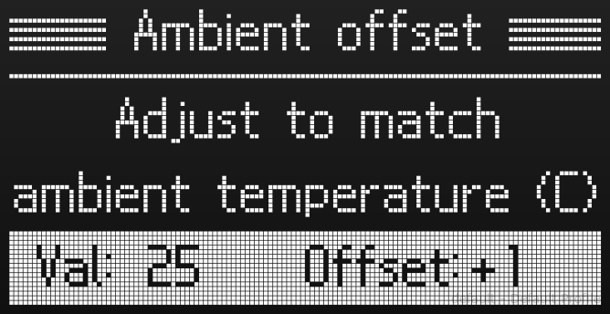

Proceed to temperature offset. On this step you'll need the tool plugged in. It'll heat it to 300°C. You should measure the nozzle output air temperature and add/remove an offset so *Val* matches the value that you externally read.

Reliably measuring airflow temperature is not that easy as you may assume. I suggest using a small nozzle attachment and by using a third hand position your probe directly front of the nozzle but not touching the metal. Give the heater ~1min of time to settle and start adjusting the offset. Once you're satisfied, click to save.

Use the "Mark as calibrated" menu item after the calibration if this is the first time.

**Debug: ** If you are "real men use raw ADC values" type of person, this is for you. It replaces the main screen with bunch of values until the next power cycle. 